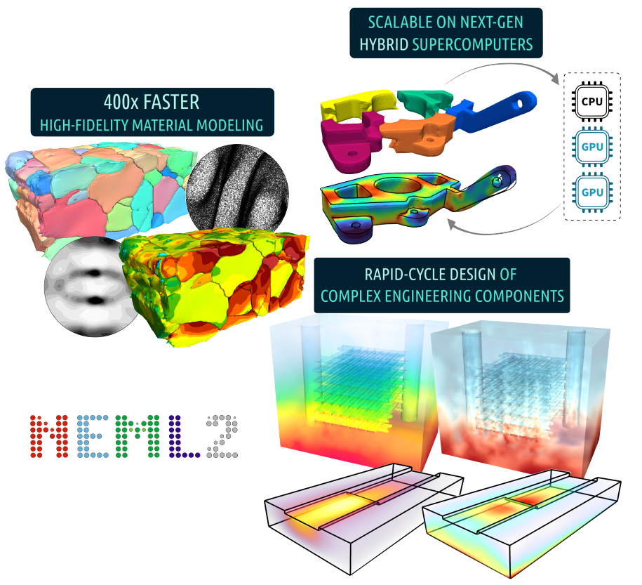

# NEML2



[](https://applied-material-modeling.github.io/neml2/) [](https://github.com/applied-material-modeling/neml2/actions/workflows/cpp.yml) [](https://github.com/applied-material-modeling/neml2/actions/workflows/python.yml)

## Overview

### The New Engineering Material model Library, version 2

NEML2 is an offshoot of [NEML](https://github.com/Argonne-National-Laboratory/neml), an earlier material modeling code developed at Argonne National Laboratory.
Like its predecessor, NEML2 provides a flexible, modular way to build material models from smaller blocks.
Unlike its predecessor, NEML2 vectorizes the material update to efficiently run on GPUs. In addition, NEML2 models can use [PyTorch](https://pytorch.org/cppdocs/) as the backend to provide first-class support for automatic differentiation, operator fusion, lazy tensor evaluation, inference mode, etc.

NEML2 is provided as open source software under a MIT [license](https://raw.githubusercontent.com/applied-material-modeling/neml2/main/LICENSE).

> **Disclaimer**
>
> NEML2 is _not_ a database of material models. There are many example material models in the library for testing and verification purposes. These models do not represent the response of any actual material.

### Quick installation

Building should be as easy as cloning the repository, configuring with CMake, compiling with `make`, and installing with `make install`. Refer to the [installation guide](https://applied-material-modeling.github.io/neml2/install.html) for more detailed instructions and finer control over various dependencies as well as other build customization.

### Features and design philosophy

#### Vectorization

NEML2 models can be vectorized, meaning that a large _batch_ of material models can be evaluated simultaneously. The vectorized models can be evaluated on either CPUs or GPUs/other accelerators. Moreover, NEML2 provides a unified implementation and user interface, for both developers and end users, that work on all supported devices.

The table below compares three approaches for solving the same problem: a crystal plasticity simulation using the Taylor method, with 50,000 grains and 250 load steps. The first approach is using NEML (the predecessor of NEML2) which is a CPU-only, fully threaded library. The second and the third approaches use NEML2, evaluating the same model on CPU and GPU (CUDA), respectively.

|       | Device | Wall time (s) | Specs                                    |
| ----- | ------ | ------------- | :--------------------------------------- |
| NEML  | CPU    | 42,500        | Intel Xeon Gold 6346 CPU with 32 threads |
| NEML2 | CPU    | 15,000        | Intel Xeon Gold 6346 CPU with 32 threads |
| NEML2 | GPU    | 34            | 2 NVIDIA RTX A5000 GPUs                  |

NEML2 is more than 2x faster than NEML on CPU, owing to more comprehensive threading and vectorization as well as Just-In-Time compilation. In this case, GPUs further speed up the calculation by more than 400 times.

#### Multiphysics coupling

NEML2 is not tied to any underlying problem physics, e.g., solid mechanics, heat transfer, fluid dynamics, electromagnetics, etc. Current modules cover thermal and mechanical material models, but the framework *can* be used to implement a wider range of constitutive models. For coupled problems, NEML2 will return the exact, coupled Jacobian entries required to achieve optimal convergence. NEML2 can be used together with [MOOSE](https://mooseframework.inl.gov/), a Multiphysics finite element framework, to solve partial differential equations.

#### Modularity and flexibility

NEML2 material models are modular – they are built up from smaller pieces into a complete model. NEML2 offers an extremely flexible way of composing models. Each individual model only defines the forward operator (and optionally its derivative) with a given set of inputs and outputs. When a set of models are *composed* together to form a composite model, dependencies among different models are automatically detected, registered, and resolved. The user has *complete control* over how NEML2 evaluates a set of models.

#### Extensibility

The library is structured so that adding a new feature to an existing material model should be as simple as possible and require as little code as possible. In line with this philosophy, the library only requires new components to provide a few partial derivatives, and NEML2 uses this information to automatically assemble the overall Jacobian using chain rule and provide the algorithmic tangent needed to integrate the model into an implicit finite element framework.  Moreover, in NEML2, implementations can forgo providing these partial derivatives, and NEML2 will calculate them with automatic differentiation.

#### Friendly user interfaces

There are three general ways of interfacing with NEML2 material models: the compiled C++ library, the Python package, and the Runner. In all interfaces, creation and archival of NEML2 models rely on input files written in the hierarchical [HIT](https://github.com/idaholab/moose/tree/master/framework/contrib/hit) format. NEML2 models created using the Pytbon bindings are fully interoperable with PyTorch tensors and modules, meaning that NEML2 material models can seamlessly work with popular machine learning frameworks developed using PyTorch.

#### Strict quality assurance

NEML2 is developed under a strict quality assurance program. Because the NEML2 distributions do not provide full, parameterized models for any actual materials, ensuring the quality of the library is a verification problem – testing to make sure that NEML2 is correctly implementing the mathematical models – rather than a validation problem of comparing the results of a model to an experiment. In NEML2, this verification is done with extensive unit testing. Additional regression tests are set up for each combination of material model to ensure result consistency across releases.

### Citing NEML2

```tex
@techreport{neml2osti2440430,
  author      = {Tianchen Hu and Mark C.  Messner and Daniel Schwen and Lynn B.  Munday and Dewen Yushu},
  title       = {NEML2: A High Performance Library for Constitutive Modeling},
  institution = {Argonne National Laboratory (ANL), Argonne, IL (United States); Idaho National Laboratory (INL), Idaho Falls, ID (United States)},
  doi         = {10.2172/2440430},
  url         = {https://www.osti.gov/biblio/2440430},
  place       = {United States},
  year        = {2024},
  month       = {09}
}
```

```tex
@misc{neml2osti1961125,
  author = {MESSNER, MARK and HU, TIANCHEN and US DOE NE-NEAMS},
  title  = {NEML2 - THE NEW ENGINEERING MATERIAL MODEL LIBRARY, VERSION 2},
  doi    = {10.11578/dc.20230314.1},
  url    = {https://www.osti.gov/biblio/1961125},
  place  = {United States},
  year   = {2023},
  month  = {01}
}
```
