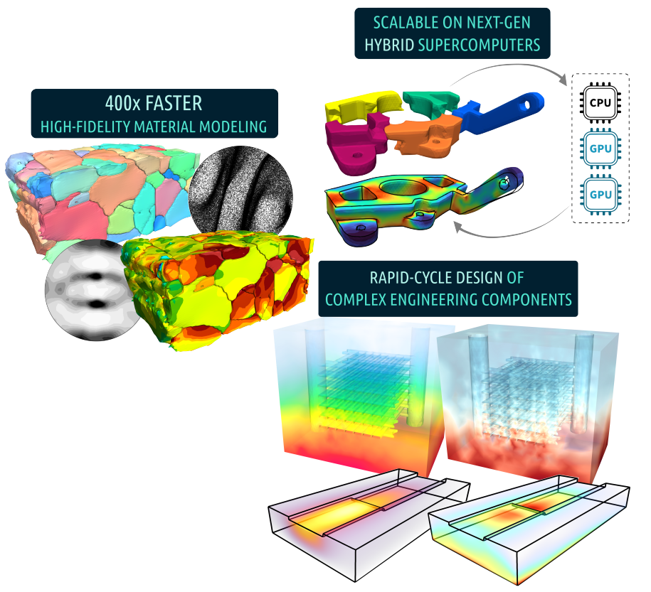

[](https://applied-material-modeling.github.io/neml2/) [](https://github.com/applied-material-modeling/neml2/actions/workflows/cpp.yaml) [](https://github.com/applied-material-modeling/neml2/actions/workflows/python.yaml) [](https://codecov.io/github/applied-material-modeling/neml2) [](https://pypi.org/project/neml2/)

## Overview

### The New Engineering Material model Library, version 2

NEML2 is an offshoot of [NEML](https://github.com/Argonne-National-Laboratory/neml), an earlier material modeling code developed at Argonne National Laboratory.
Like its predecessor, NEML2 provides a flexible, modular way to build material models from smaller blocks.
Unlike its predecessor, NEML2 vectorizes the material update on CPU and GPU using [PyTorch](https://pytorch.org/) as the tensor backend, with first-class support for automatic differentiation, operator fusion, lazy tensor evaluation, and inference mode.

NEML2 is provided as open source software under a MIT [license](https://raw.githubusercontent.com/applied-material-modeling/neml2/main/LICENSE).

> **Disclaimer**
>
> NEML2 is _not_ a database of material models. There are many example material models in the library for testing and verification purposes. These models do not represent the response of any actual material.



### Quick installation

**Python package (recommended):** Pre-built wheels are available on [PyPI](https://pypi.org/project/neml2/):

```shell
pip install neml2
```

The wheel ships everything a C++ consumer needs too — `libneml2_aoti.so`, the public headers, and the CMake config files all land under your `site-packages/neml2/`. See the [installation guide](https://applied-material-modeling.github.io/neml2/install.html) for finer control over the torch variant (CPU / CUDA / ROCm) and the C++ integration guide for `find_package(neml2)` wiring.

**Developer source build** (only when contributing to the AOTI runtime under `neml2/csrc/`):

```shell
git clone -b main https://github.com/applied-material-modeling/neml2.git
cd neml2
pip install -e ".[dev]"          # editable install drives the cmake `dev` preset
```

Once NEML2 is installed, refer to the [getting started](https://applied-material-modeling.github.io/neml2/tutorials-getting-started.html) guide for commonly used APIs.

### Features and design philosophy

#### Vectorization

NEML2 models can be vectorized, meaning that a large _batch_ of material models can be evaluated simultaneously. The vectorized models can be evaluated on either CPUs or GPUs/other accelerators. Moreover, NEML2 provides a unified implementation and user interface, for both developers and end users, that work on all supported devices.

The table below compares three approaches for solving the same problem: a crystal plasticity simulation using the Taylor method, with 50,000 grains and 250 load steps. The first approach is using NEML (the predecessor of NEML2) which is a CPU-only, fully threaded library. The second and the third approaches use NEML2, evaluating the same model on CPU and GPU (CUDA), respectively.

|       | Device | Wall time (s) | Specs                                    |
| ----- | ------ | ------------- | :--------------------------------------- |
| NEML  | CPU    | 42,500        | Intel Xeon Gold 6346 CPU with 32 threads |
| NEML2 | CPU    | 15,000        | Intel Xeon Gold 6346 CPU with 32 threads |
| NEML2 | GPU    | 68            | 1 NVIDIA RTX A5000 GPUs                  |
|       |        | 34            | 2 NVIDIA RTX A5000 GPUs                  |

NEML2 is more than 2x faster than NEML on CPU, owing to more comprehensive threading and vectorization, and (for compiled workloads) AOT-Inductor codegen via `neml2-compile`. In this case, GPUs further speed up the calculation by more than 400 times.

#### Multiphysics coupling

NEML2 is not tied to any underlying problem physics. Current modules cover solid mechanics (including crystal plasticity), chemical reactions, phase-field fracture, porous flow, finite volume, and KWN-style precipitation kinetics, and the framework is set up to take on more. For coupled problems, NEML2 assembles the full Jacobian (via chain rule across composed models, or via automatic differentiation), which is what implicit solvers need to converge robustly. NEML2 can be used together with [MOOSE](https://mooseframework.inl.gov/), a Multiphysics finite element framework, to solve partial differential equations.

#### Modularity and flexibility

NEML2 material models are modular – they are built up from smaller pieces into a complete model. Each individual model only defines the forward operator (and optionally its derivative) with a given set of inputs and outputs. Users control how those models are composed and wired together; NEML2 detects the dependencies and resolves the evaluation order automatically.

#### Extensibility

Adding a new model usually means writing a small forward operator and (optionally) its partial derivatives. NEML2 composes these into the full Jacobian via chain rule across composed models, and falls back to automatic differentiation for any derivative you don't provide — so you can start with a minimal implementation and add hand-coded derivatives later for speed.

#### Friendly user interfaces

NEML2 is used from Python (the primary API), through the bundled CLI tools (`neml2-run`, `neml2-inspect`, `neml2-syntax`, `neml2-compile`), or from C++ via the AOTI runtime bundled in the wheel. In every interface, models are described by input files in the hierarchical [HIT](https://github.com/applied-material-modeling/neml2-hit) format. NEML2 models created in Python are fully interoperable with PyTorch tensors and modules, so they slot into PyTorch-based machine learning workflows directly.

#### Testing

NEML2 is verification-tested at three layers: unit tests for individual model leaves, regression tests that pin each scenario's output to a checked-in reference, and verification tests that compare against analytical or benchmark ground truth. The example models shipped in the library are for testing — they are not parameterized for any real material, so the project does not claim experimental validation.

### Citing NEML2

```tex
@article{neml2_softwarex_2025,
  title = {NEML2: An efficient and modular multiphysics constitutive modeling library for hybrid computing environments},
  journal = {SoftwareX},
  volume = {31},
  pages = {102302},
  year = {2025},
  issn = {2352-7110},
  doi = {https://doi.org/10.1016/j.softx.2025.102302},
  url = {https://www.sciencedirect.com/science/article/pii/S2352711025002687},
  author = {Tianchen Hu and Mark C. Messner},
  keywords = {Constitutive model, GPU, Multiphysics}
}
```

```tex
@techreport{neml2osti2440430,
  author      = {Tianchen Hu and Mark C.  Messner and Daniel Schwen and Lynn B.  Munday and Dewen Yushu},
  title       = {NEML2: A High Performance Library for Constitutive Modeling},
  institution = {Argonne National Laboratory (ANL), Argonne, IL (United States); Idaho National Laboratory (INL), Idaho Falls, ID (United States)},
  doi         = {10.2172/2440430},
  url         = {https://www.osti.gov/biblio/2440430},
  place       = {United States},
  year        = {2024},
  month       = {09}
}
```

```tex
@misc{neml2osti1961125,
  author = {MESSNER, MARK and HU, TIANCHEN and US DOE NE-NEAMS},
  title  = {NEML2 - THE NEW ENGINEERING MATERIAL MODEL LIBRARY, VERSION 2},
  doi    = {10.11578/dc.20230314.1},
  url    = {https://www.osti.gov/biblio/1961125},
  place  = {United States},
  year   = {2023},
  month  = {01}
}
```
